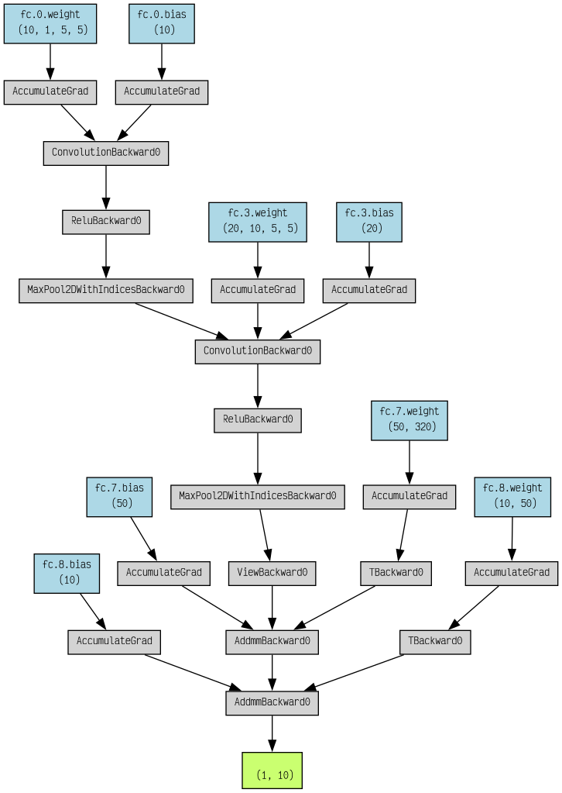
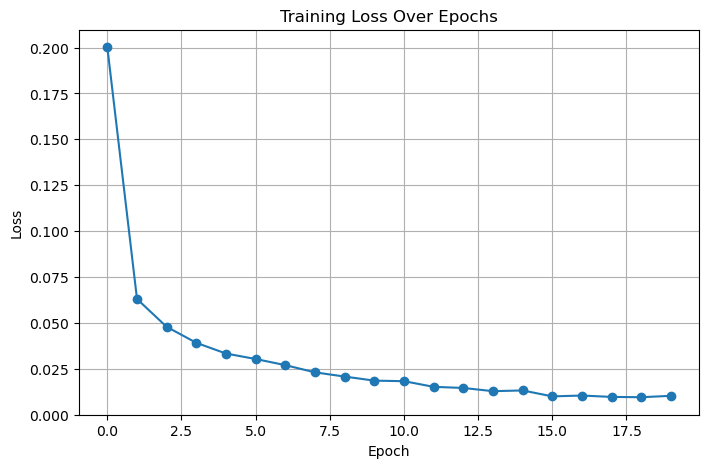
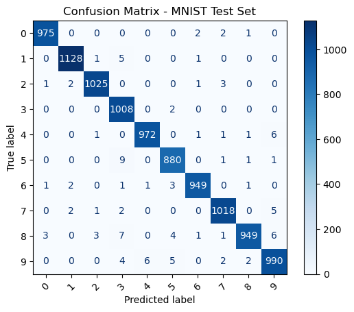
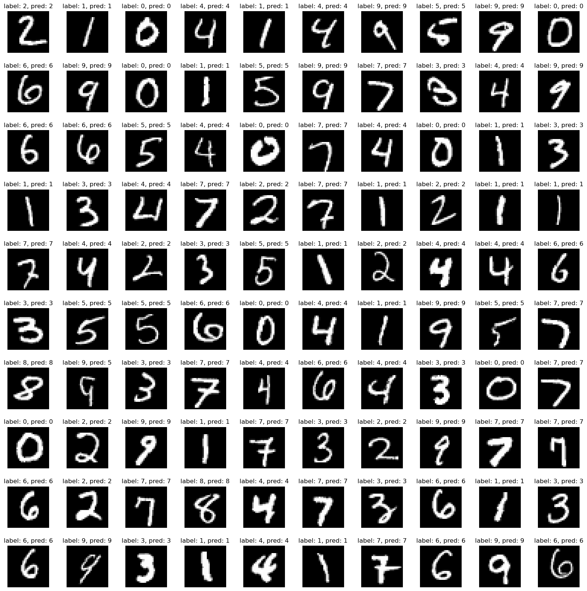

# MNIST CNN Classifier

This repository contains a PyTorch-based convolutional neural network (CNN) for classifying handwritten digits from the [MNIST dataset](http://yann.lecun.com/exdb/mnist/). The project demonstrates the full workflow: data loading, preprocessing, model definition, training, evaluation, and visualization.

## Project Structure

```
. 
├── confusion.png # Confusion matrix plot 
├── loss.png # Training loss plot 
├── MNIST-MODEL.pth # Saved PyTorch model weights 
├── playground.ipynb # Notebook for model inference and visualization 
├── pred.png # Sample predictions visualization 
├── readme.md # Project documentation 
├── workspace.ipynb # Main notebook: training and evaluation 
└── dataset/ 
    ├── test/ 
    │   ├── t10k-images-idx3-ubyte 
    │   └── t10k-labels-idx1-ubyte 
    └── train/ 
        ├── train-images-idx3-ubyte 
        └── train-labels-idx1-ubyte
```

## Getting Started

### 1. Requirements

- Python 3.7+
- PyTorch
- torchvision
- numpy
- matplotlib
- scikit-learn
- tqdm

Install dependencies with:

```sh
pip install torch torchvision numpy matplotlib scikit-learn tqdm
```

2. Dataset

    The MNIST dataset are placed the `dataset/train` and `dataset/test` directories as shown above.

3. Training

    Open and run all cells in workspace.ipynb to:

    - Compute dataset statistics (mean, std)
    - Load and preprocess data
    - Define and train the CNN model
    - Save the trained model to MNIST-MODEL.pth
    - Visualize training loss and confusion matrix

4. Inference

    Use playground.ipynb to:

    - Load the trained model
    - Run predictions on test images
    - Visualize predictions
    - Model Architecture

The CNN model (MNIST_CNN) consists of:

- 2 convolutional layers with ReLU and max pooling
- Flattening layer
- 2 fully connected (linear) layers

```
==========================================================================================
Layer (type:depth-idx)                   Output Shape              Param #
==========================================================================================
MNIST_CNN                                [64, 10]                  --
├─Sequential: 1-1                        [64, 10]                  --
│    └─Conv2d: 2-1                       [64, 10, 24, 24]          260
│    └─ReLU: 2-2                         [64, 10, 24, 24]          --
│    └─MaxPool2d: 2-3                    [64, 10, 12, 12]          --
│    └─Conv2d: 2-4                       [64, 20, 8, 8]            5,020
│    └─ReLU: 2-5                         [64, 20, 8, 8]            --
│    └─MaxPool2d: 2-6                    [64, 20, 4, 4]            --
│    └─Flatten: 2-7                      [64, 320]                 --
│    └─Linear: 2-8                       [64, 50]                  16,050
│    └─Linear: 2-9                       [64, 10]                  510
==========================================================================================
Total params: 21,840
Trainable params: 21,840
Non-trainable params: 0
Total mult-adds (Units.MEGABYTES): 31.21
==========================================================================================
Input size (MB): 0.20
Forward/backward pass size (MB): 3.64
Params size (MB): 0.09
Estimated Total Size (MB): 3.92
==========================================================================================
```



See the model definition in workspace.ipynb or playground.ipynb.

# Results







# License

This project is for educational purposes.